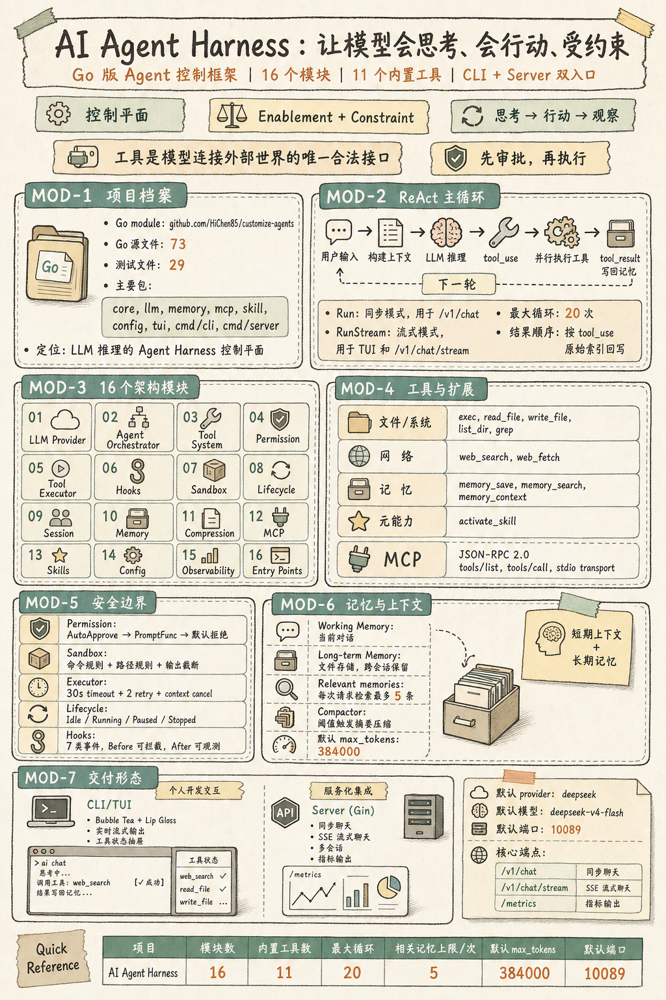

# AI Agent Harness 项目展示

## 一句话定位

这是一个用 Go 构建的 AI Agent Harness。它不是普通聊天机器人，而是围绕大模型推理建立的一层运行时控制框架：模型负责判断下一步，Harness 负责把“判断”落成可审计、可约束、可扩展的行动。

它的核心价值可以概括为两件事：

- **赋能**：工具调用、记忆检索、技能扩展、MCP 动态协议，让模型能连接文件系统、网络、长期记忆和外部工具服务。
- **约束**：权限审批、安全沙箱、生命周期、Hook、执行超时和指标追踪，让行动能力始终落在可控边界内。

## 总览信息图

## 系统如何工作

用户输入进入 Agent 后，系统会把系统提示、工作记忆、相关长期记忆、已激活技能和工具定义组装成一次 LLM 请求。模型如果只返回文字，流程结束；如果返回 `tool_use`，Agent 会并行执行工具，把 `tool_result` 写回记忆，再进入下一轮推理。

这个循环对应典型 ReAct 模式：

| 阶段 | 系统动作 | 价值 |
|---|---|---|
| Reason | LLM 根据上下文判断下一步 | 保留模型推理能力 |
| Act | Agent 执行工具调用 | 把意图变成行动 |
| Observe | 工具结果写回上下文 | 让模型基于事实继续 |
| Repeat | 直到没有 `tool_use` | 支持多步任务 |

项目在 `Run` 和 `RunStream` 两条路径上实现同一套闭环。`Run` 适合同步 HTTP 调用，`RunStream` 则服务于 TUI 和 SSE 流式接口，让用户实时看到文本增量、工具开始和工具结果。

## 架构分层

项目可以按四层理解：

| 层级 | 模块 | 说明 |
|---|---|---|
| 入口层 | `cmd/cli`, `cmd/server`, `tui` | 提供终端交互、HTTP API、SSE 流式输出和会话接口 |
| 编排层 | `core/agent.go` | 驱动 ReAct 循环，协调 LLM、工具、记忆、技能、权限和 Hook |
| 能力层 | `llm`, `memory`, `mcp`, `skill`, tools | 提供模型通信、记忆、动态工具、技能和内置工具 |
| 约束层 | Permission, Sandbox, Executor, Lifecycle, Hooks, Metrics | 控制风险、超时、状态、拦截、审计和观测 |

这种分层让项目的边界非常清楚：入口层只负责交互，Agent 只负责编排，具体能力通过接口注入，安全与观测通过横切机制接入。

## 关键模块

### LLM Provider

`llm.Provider` 是最小模型调用接口，`StreamProvider` 在此基础上增加流式能力。当前实现使用 Anthropic Messages 兼容协议，并通过 `RetryProvider` 处理限流、5xx、连接拒绝和超时等可恢复错误。

流式解析是项目里最关键的工程点之一。代码没有单纯依赖 delta 的 `type` 字段，而是根据当前内容块状态路由数据：如果正在接收工具调用，那么无论 delta 叫 `input_json_delta` 还是 `text_delta`，都会被累积为工具参数。这解决了 Deepseek Anthropic 兼容输出中的非标准行为。

### Agent 编排器

`core.Agent` 是系统枢纽。它不实现具体业务，只负责按顺序协调组件：

1. 触发 session hook。
2. 把用户消息写入工作记忆。
3. 构建 LLM 请求。
4. 调用 Provider。
5. 解析文字和工具调用。
6. 并行执行工具。
7. 把结果写回记忆并继续循环。

为避免工具链无限循环，Agent 设置了 20 次最大迭代上限。工具并行执行时按原始索引写回结果，保证 LLM 看到的 `tool_result` 顺序与 `tool_use` 顺序一致。

### 工具系统

工具统一表示为 `Tool{Definition, Execute}`。`Definition` 是给模型看的 JSON Schema，`Execute` 是实际执行逻辑。这个结构同时适用于内置工具和 MCP 动态发现的工具。

当前内置能力覆盖文件、命令、搜索、网页抓取、记忆和技能激活：

| 类别 | 工具 |
|---|---|
| 文件与系统 | `exec`, `read_file`, `write_file`, `list_dir`, `grep` |
| 网络 | `web_search`, `web_fetch` |
| 记忆 | `memory_save`, `memory_search`, `memory_context` |
| 元能力 | `activate_skill` |

### 约束与安全

权限系统采用“白名单自动通过，其他走审批，默认拒绝”的策略。Sandbox 只包装 `exec`，负责命令规则、路径规则和输出截断；ToolExecutor 提供 30 秒超时、重试和 context 取消保护；Lifecycle 支持 `Idle`、`Running`、`Paused`、`Stopped` 四种状态。

这几层不是重复防护，而是处在不同位置：

| 机制 | 位置 | 解决的问题 |
|---|---|---|
| Permission | 工具执行前 | 高风险动作是否允许 |
| Hook | LLM 或工具关键节点 | 审计、拦截、扩展 |
| Sandbox | `exec` 内部包装 | 命令和路径风险 |
| Executor | 工具调用外层 | 超时、重试、阻塞 |
| Lifecycle | Agent 循环外层 | 暂停、停止、优雅退出 |

[Sandbox 设计文档](sandbox-explainer.md)

## 记忆、技能与 MCP

记忆系统分为工作记忆和长期记忆。工作记忆负责当前上下文，长期记忆通过文件存储跨会话保留。每次请求会按用户输入检索相关记忆，最多注入 5 条；当上下文接近阈值时，Compactor 会用 LLM 摘要旧消息。

技能系统借鉴 Claude Code 的按需加载思路。系统提示中先注入技能索引，只有被激活的技能才追加完整 prompt，避免把大量无关技能一次性塞入上下文。

MCP 模块实现 JSON-RPC 2.0 客户端，通过 stdio transport 连接外部 MCP Server，使用 `tools/list` 发现工具，再用 `tools/call` 调用工具。这样新工具不需要编译进主程序，也可以由其他语言实现。

## 交付形态

项目同时支持个人开发交互和服务化集成：

| 形态 | 技术 | 适用场景 |
|---|---|---|
| CLI/TUI | Bubble Tea + Lip Gloss | 本地开发、调试、演示、流式交互 |
| HTTP Server | Gin + SSE | API 集成、多会话、服务化部署 |

Server 默认端口为 `10089`，核心端点包括 `/v1/chat`、`/v1/chat/stream`、`/v1/sessions`、`/v1/memory/search`、`/v1/status`、`/metrics` 和 `/v1/metrics`。配置文件 `agent.yaml` 当前默认 provider 为 `deepseek`，模型为 `deepseek-v4-flash`，`max_tokens` 为 `384000`。

## 项目价值

这个项目的亮点不在“能不能调用一个模型”，而在于它把 Agent 运行时的关键问题做成了清晰的工程结构：

- LLM 接入被 Provider 抽象隔离，便于替换和重试。
- Agent 循环集中在编排器中，逻辑可读、可测、可扩展。
- 工具系统统一了内置工具和 MCP 工具。
- 安全边界分层落位，不把所有风险控制堆在一个函数里。
- 记忆、技能、配置热更新和指标输出都围绕运行时需求设计。
- CLI 与 Server 共享核心模块，避免两套实现分叉。

因此，它适合作为一个“从零到一构建 Agent 系统”的展示项目：既能讲清楚基础原理，也能展示真实工程中必须面对的流式解析、工具执行、安全边界、上下文管理和服务化交付问题。
